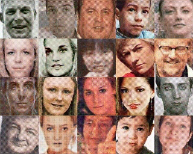

# GLANN

**this project will contrast the face image which is generated by  [GLANN](https://arxiv.org/abs/1812.08985), [IMLE](https://arxiv.org/abs/1809.09087) and [GLO](https://arxiv.org/abs/1707.05776)**

## Introduction

GLANN(Generative Latent Nearest Neighbors) combines the strengths of both IMLE and GLO

<div align="center">
	
</div>

- 1. Adopt the ideas similar to GLO, but L1 loss was replaced by[perceptual loss](https://arxiv.org/abs/1603.08155)

- 2. IMLE is used to make the training samples have latent nearest neighbors to generate similar images

## Result
### origin
<div align="center">
	
</div>

### GLO
<div align="center">
	
</div>

### IMLE
<div align="center">
	
</div>

### GLANN
<div align="center">
	
</div>

## Run
### GLO
```python
python main.py -m GLO
```
- 1. The generate Latent code in glo_result/glo_encoder_code
- 2. The generate image was in glo_result/glo_eval

### IMLE
```python
python main.py -m IMLE
```
- 1. The generate image was in imle_result/imle_eval

### GLANN
```python
python main.py -m GLANN
```
- 1. The generate Latent code in glann_result/glann_encoder_code
- 2. The generate image was in glann_result/glann_eval

## DOWNLOAD(baidu)
[Data](https://pan.baidu.com/s/1QEDcbWO0yZ3zIxBuTo4ZxQ)

[IMLE](https://pan.baidu.com/s/1h4Nwf-m4aKsYiJ44Rmv2Fw)

[GLO](https://pan.baidu.com/s/1tX7wqMxvks8cxvgz93Seaw)

[GLANN](https://pan.baidu.com/s/1V8KUoHzUrHrYOuQ8hzzwoQ)
